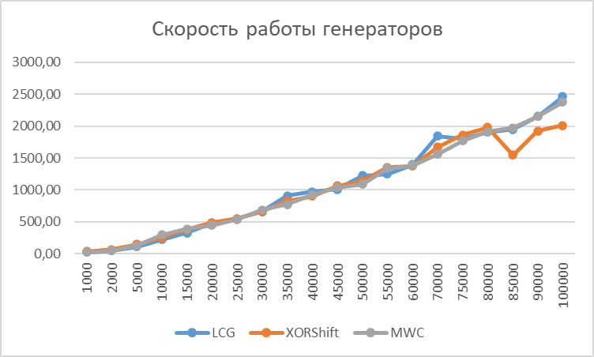

# Лабораторная работа 3

Выполнила Семиклит Екатерина СКБ222

## 📊 Результаты тестирования

Ниже представлены графики времени работы генераторов случайных чисел:

## 🔗 Репозиторий

Исходный код доступен в [репозитории проекта](https://github.com/BigSnowHill/Programming-Techniques-LW3).
